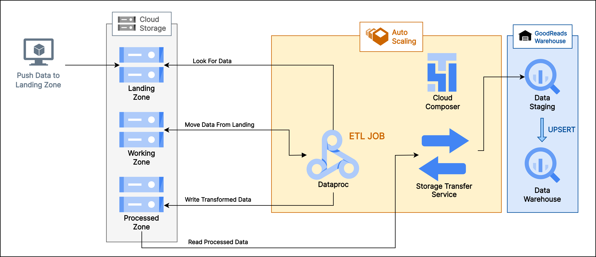
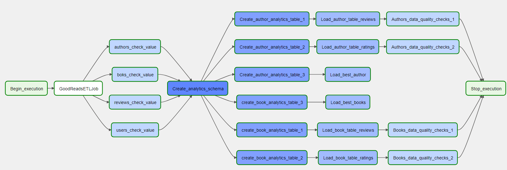
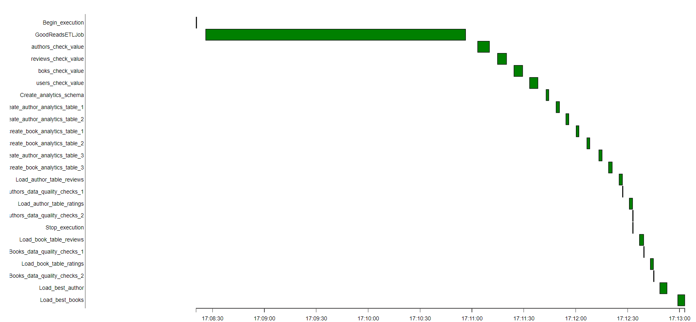

# GoodReads Data Pipeline Using GCP

## Architecture

Pipeline Consists of various modules:

 - ETL Jobs
 - BigQuery Warehouse Module
 - Analytics Module 

 #### Overview
The data collected from the goodreads API is stored on local disk and is timely moved to the Landing Bucket on Cloud Storage. ETL jobs are written in spark and scheduled in airflow (cloud composer) to run every 10 minutes.  

### ETL Flow

 - Data Collected from the API is moved to landing zone Cloud Storage.
 - ETL job has storage module which copies data from landing zone to working zone.
 - Once the data is moved to working zone, spark job is triggered which reads the data from working zone and apply transformation. Dataset is repartitioned and moved to the Processed Zone.
 - Warehouse module of ETL jobs picks up data from processed zone and stages it into the BigQuery staging tables.
 - Using the BigQuery staging tables and UPSERT operation is performed on the Data Warehouse tables to update the dataset.
 - ETL job execution is completed once the Data Warehouse is updated. 
 - Airflow DAG runs the data quality check on all Warehouse tables once the ETL job execution is completed.
 - Airflow DAG has Analytics queries configured in a Custom Designed Operator. These queries are run and again a Data Quality Check is done on some selected Analytics Table.
 - Dag execution completes after these Data Quality check.

## Environment Setup

### Hardware Used
Dataproc - I used a single node cluster with below Instance Types:

    n2-standard-4
    4 vCore, 16 GiB memory
BigQuery: For BigQuery I used 2 Node cluster with Instance Types `dc2.large`

### Setting Up Composer

Cloud Composer is a fully managed data workflow orchestration service that empowers you to author, schedule, and monitor pipelines. Check out - [Cloud Composer](https://cloud.google.com/composer/docs/how-to/managing/creating)

### Setting up Dataproc
Spinning up Dataproc cluster is pretty straight forward. You can use GCP Docs available [here](https://cloud.google.com/dataproc/docs/guides/create-cluster).

ETL jobs in the project uses [BigQuery](https://airflow.apache.org/docs/apache-airflow-providers-google/stable/operators/cloud/bigquery.html) to connect to BigQuery cluster to run staging and warehouse queries. 

Copy the ETL scripts to Cloud Storage and we have our Dataproc ready to run jobs. 

### Setting up BigQuery
You can follow the GCP [Guide](https://cloud.google.com/bigquery/docs/datasets) to create dataset.

## How to run 
Make sure Composerr is running. 
Open the Airflow UI `http://< region >-composer:3880` 

DAG View:

DAG Gantt View: 

 ## Scenarios

-   Data increase by 100x. read > write. write > read
    
    -   BigQuerry: Analytical database, optimized for aggregation, also good performance for read-heavy workloads
    -   Increase Dataproc cluster size to handle bigger volume of data

-   Pipelines would be run on 7am daily. how to update dashboard? would it still work?
    
    -   DAG is scheduled to run every 10 minutes and can be configured to run every morning at 7 AM if required. 
    -   Data quality operators are used at appropriate position. In case of DAG failures email triggers can be configured to let the team know about pipeline failures.
    
-   Make it available to 100+ people
    -   We can set the concurrency limit for your Dataproc cluster. While the concurrency limit is 50 parallel queries for a single period of time, this is on a per cluster basis, meaning you can launch as many clusters as fit for you business.
 